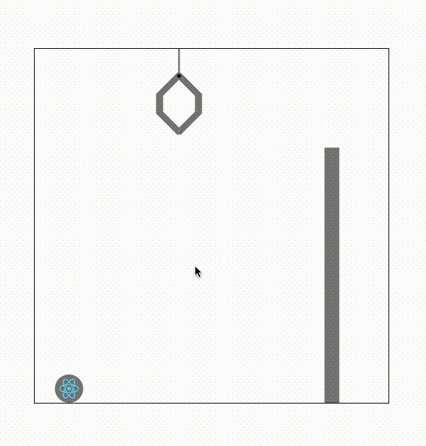

<h2 align="center">Claw-Machine-Js</h2>

  

ClawJs is a physic-based claw machine that provides various features for customization.

-   [Demo](#demo)
-   [Installation](#installation)
-   [Usage](#usage)
-   [Claw Machine Parameters](#claw-machine-parameters)
-   [Initial Ball Parameters](#initial-ball-parameters)
-   [Known Problems](#known-problems)
-   [License](#license)

## Demo

Check out the live demo here: [Live Demo](https://bhalbritter.github.io/claw-machine-js-showcase/)

## Installation

    npm i claw-machine-js

## Features

-   Fully customizable claw machine parameters (size, speed, etc.)
-   Support for dynamic ball configurations
-   TypeScript support for better developer experience

## Usage

    import { ClawMachineCommands } from 'clawjs/dist/ClawMachine'
    import { IInitialBall } from 'clawjs/dist/interfaces/InitialBall'

    const initialState: IInitialBall[] = [
    	{
    		text: 'test',
    		ballColor: 'gray',
    		ballTextColor: 'yellow',
    		icon: react,
    	},
    ]

    <ClawMachine alreadyDroppedBalls={[]}
        addToDroppedBalls={(balls) => console.log(balls)}
        ballData={initialState}
    />

## Claw Machine Parameters

| **Prop Name**            | **Type**        | **Default** | **Required** | **Description**                                                                                                            |
| ------------------------ | --------------- | ----------- | ------------ | -------------------------------------------------------------------------------------------------------------------------- |
| `ballData`               | `Array<Object>` | -           | Yes          | An array of ball configurations. Each ball object should have `text`, `ballColor`, `ballTextColor`, and optionally `icon`. |
| `alreadyDroppedBalls`    | `Array`         | -           | Yes          | List of balls that have already been dropped from the machine.                                                             |
| `addToDroppedBalls`      | `Function`      | -           | Yes          | Callback function triggered when a ball is dropped.                                                                        |
| `width`                  | `Number`        | `600`       | No           | The width of the claw machine in pixels.                                                                                   |
| `height`                 | `Number`        | `400`       | No           | The height of the claw machine in pixels.                                                                                  |
| `ballRadius`             | `Number`        | `20`        | Yes          | The radius of each ball in pixels.                                                                                         |
| `gravity`                | `Number`        | `0.2`       | No           | The gravity effect on the balls. Higher values make balls fall faster.                                                     |
| `friction`               | `Number`        | `0.99`      | No           | The air resistance that slows the balls’ movement.                                                                         |
| `groundFriction`         | `Number`        | `0.8`       | No           | The friction between the balls and the ground surface.                                                                     |
| `clawSize`               | `Number`        | `30`        | No           | The size of the claw's opening in pixels.                                                                                  |
| `clawWidth`              | `Number`        | `10`        | No           | The thickness of the claw's arms.                                                                                          |
| `dividerLineWidth`       | `Number`        | `70`        | No           | The width of the divider line in pixels.                                                                                   |
| `dividerLineHeight`      | `Number`        | `140`       | No           | The height of the divider line in pixels.                                                                                  |
| `dividerLineThickness`   | `Number`        | `20`        | No           | The thickness of the divider line in pixels.                                                                               |
| `dividerLineFillColor`   | `String`        | `gray`      | No           | The color of the divider line.                                                                                             |
| `dividerLineBorderColor` | `String`        | `gray`      | No           | The border color of the divider line.                                                                                      |
| `clawColor`              | `String`        | `"gray"`    | No           | The color of the claw.                                                                                                     |
| `clawBoltColor`          | `String`        | `"black"`   | No           | The color of the claw's bolts.                                                                                             |
| `clawStartPositionX`     | `Number`        | `200`       | No           | Initial horizontal position of the claw when it is raised.                                                                 |
| `clawStartPositionY`     | `Number`        | `40`        | No           | Initial vertical position of the claw when it is raised.                                                                   |
| `clawStartOpenAngle`     | `Number`        | `0`         | No           | Initial open Angle of the Claw.                                                                                            |
| `clawSpeedX`             | `Number`        | `2`         | No           | The speed of the claw moving horizontally (X-axis).                                                                        |
| `clawSpeedY`             | `Number`        | `1.1`       | No           | The speed of the claw moving vertically (Y-axis).                                                                          |
| `clawOpenSpeed`          | `Number`        | `1`         | No           | The speed of the claw opening.                                                                                             |

## Initial Ball Parameters

| **Prop Name**      | **Type**                      | **Default**        | **Required** | **Description**                                                  |
| ------------------ | ----------------------------- | ------------------ | ------------ | ---------------------------------------------------------------- |
| `text`             | `String`                      | -                  | Yes          | Text displayed inside the ball if no icon is provided.           |
| `icon`             | `String`                      | ball text          | No           | The file path or URL to an icon image displayed inside the ball. |
| `radius`           | `Number`                      | global ball radius | No           | Radius of the ball, in pixels.                                   |
| `startX`           | `Number`                      | random             | No           | Initial X-coordinate position of the ball on the canvas.         |
| `startY`           | `Number`                      | random             | No           | Initial Y-coordinate position of the ball on the canvas.         |
| `startXMomentum`   | `Number`                      | random             | No           | Initial horizontal momentum (velocity) of the ball.              |
| `startYMomentum`   | `Number`                      | random             | No           | Initial vertical momentum (velocity) of the ball.                |
| `imageHeight`      | `Number`                      | ball size          | No           | Height of the image inside the ball.                             |
| `imageWidth`       | `Number`                      | ball size          | No           | Width of the image inside the ball.                              |
| `ballColor`        | `String`                      | `red`              | No           | Color of the ball.                                               |
| `ballTextFontSize` | `Number`                      | ball size          | No           | Font size of the text inside the ball.                           |
| `ballTextColor`    | `String`                      | `white`            | No           | Text color of the text inside the ball.                          |
| `ballTextAlign`    | `center` or `left` or `right` | `center`           | No           | Vertical alignment of the text inside the ball.                  |
| `ballTextBaseline` | `middle` or `top` or `bottom` | `middle`           | No           | Horizontal alignment of the text inside the ball.                |

## Claw Control Functions

It is also possible to control the claw with a number of functions.

    import { ClawMachineCommands } from 'clawjs/dist/ClawMachine'
    import { IInitialBall } from 'clawjs/dist/interfaces/InitialBall'

    const clawMachineRef = useRef<ClawMachineCommands>(null)
    const initialState: IInitialBall[] = [
    	{
    		text: 'test',
    		ballColor: 'gray',
    		ballTextColor: 'yellow',
    		icon: react,
    	},
    ]

    const handleMoveClawRight = async () => {
    	if (clawMachineRef.current) {
    		clawMachineRef.current.moveClawRight()
    	}
    }

    <ClawMachine alreadyDroppedBalls={[]}
        ref={clawMachineRef}
        addToDroppedBalls={(balls) => console.log(balls)}
        ballData={initialState}
    />
    <button onMouseDown={() => handleMoveClawRight()}>Move Right</button>

### Functions

#### `moveClaw`

-   **Return Type**: `Promise<void>`
-   **Parameters**:
    -   `x` (number): The desired x-coordinate for the claw.
    -   `y` (number): The desired y-coordinate for the claw.
    -   `angle` (number): The desired angle for the claw's open/closed state.
    -   `immediateReturn` (boolean, optional): If `true`, the claw closes if it touches a ball and throws it to the exit area.
-   **Description**:
    Moves the claw to a specified position. Resolves the promise once the position is reached.

---

#### `moveClawRight`

-   **Return Type**: `void`
-   **Parameters**: None
-   **Description**:
    Moves the claw to the right at a set speed (`dx`) until `stopMoving()` is called.

---

#### `moveClawLeft`

-   **Return Type**: `void`
-   **Parameters**: None
-   **Description**:
    Moves the claw to the left at a set speed (`dx`) until `stopMoving()` is called.

---

#### `stopMoving`

-   **Return Type**: `void`
-   **Parameters**: None
-   **Description**:
    Stops any ongoing movement initiated by `moveClawRight()` or `moveClawLeft()`.

---

#### `moveClawDown`

-   **Return Type**: `Promise<void>`
-   **Parameters**:
    -   `clawDropDelay` (number, optional): The delay in milliseconds between the claw reaching the drop position and its reset. Defaults to `500ms`.
-   **Description**:
    Moves the claw downward and attempts to grab a ball. Resolves the promise once the claw operation completes.

## Known Problems

#### Balls slip out of the claw after they are grabbed

Currently, sometimes balls are able to leave the claw. This is especially the case if:

-   The balls are very small
-   The horizontal speed of the claw is very high
-   Many balls are grabbed at once

The easiest way is to prevent the cases described above.

## License

ClawJs is licensed under the MIT License. See the [LICENSE](./LICENSE) file for details.
